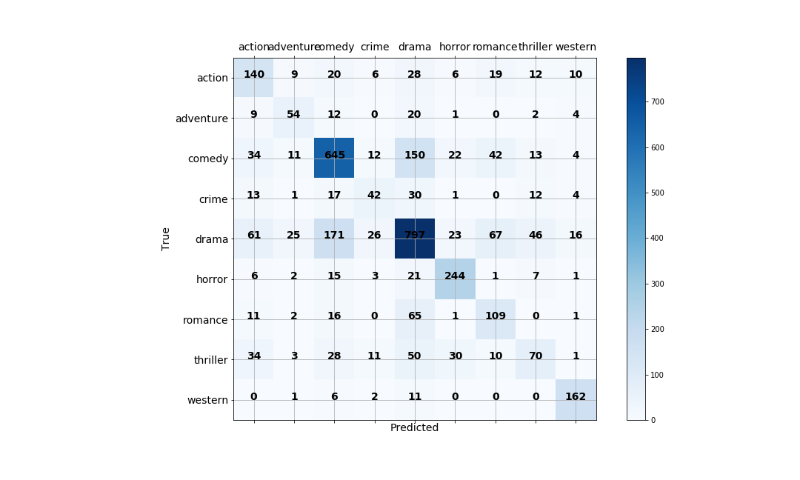

# Movie Plot Classification 
Classify movie genres based on NLP analysis of the plot summary.

## Motivation and Process 

For this project, my goal is to predict the genre of a movie based on it's plot description. I was given this prompt as a as an assignment in my Data Science bootcamp course at [Flatiron School](https://flatironschool.com/career-courses/data-science-bootcamp). The dataset was provided to us as part of the assignment. 

To make my predictions, I tokenized the words in the movies plots using sklearn's CountVectorizer. I used a custom tokenizer using NLTK's WordLemmatizer. The word count vectors were transformed using a TF-IDF transformer, and the predictions were determined by a squared-hinge support vector machine using stochastic gradient descent. I used stochastic gradient descent because it converges more quickly than a typical SVC, which proved very useful in a model with so many dimesions. 

Since there was a large class imbalance, I used SMOTE to over-sample under represented classes. I also used a Stratified K-fold split to cross validate my results. 

## Result 

Our goal was to maximize the weighted F1 score for our predictions. Every class member produced their own model, and the results were compared on a previously unseen test set. My model performed well, placing 2nd in the class with a 63% weighted F1. 

## Next Steps

Improvements to the model can be made by adjusting the tokenizer or incorporating ensemble methods like a voting classifier. 
